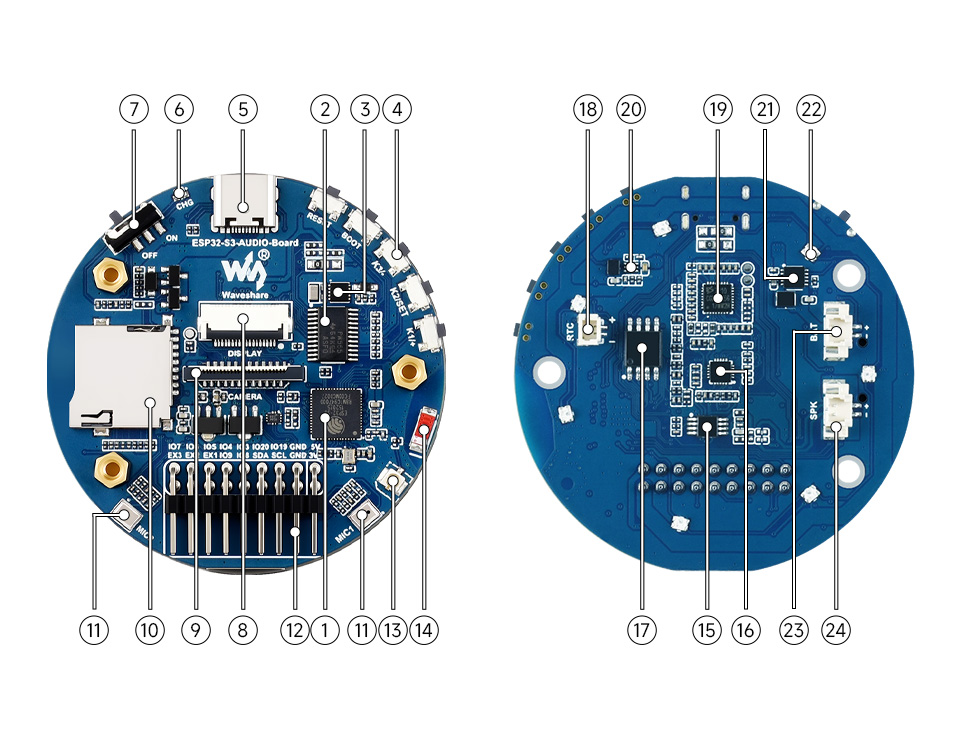

# 하드웨어 마이그레이션 가이드: ESP32 DevKit → Waveshare ESP32-S3-AUDIO-Board

작성일: 2026-09-11

## 1. 새 하드웨어 정보

| 구분 | 제품 | 참고 링크 |
|---|---|---|
| 메인 보드 | Waveshare **ESP32-S3-AUDIO-Board** (ESP32-S3R8, 16MB Flash + 8MB Octal PSRAM, 듀얼 마이크 어레이, 스피커 앰프 내장) | https://www.waveshare.com/wiki/ESP32-S3-AUDIO-Board |
| 디스플레이 | Waveshare **2inch Capacitive Touch LCD** (ST7789T3, 240×320, 터치 CST816D, 18핀 FPC) | https://www.waveshare.com/wiki/2inch_Capacitive_Touch_LCD |
| 연결 방식 | 디스플레이의 18핀 FPC 케이블 → 보드의 18PIN display interface | |

### 보드 내장 부품
- ESP32-S3R8 (Dual-core 240MHz)
- ES8311: 오디오 코덱 (DAC, 스피커 출력) — I2C 0x18
- ES7210: 4채널 오디오 ADC (듀얼 마이크 입력) — I2C 0x40
- NS4150B: 모노 Class-D 스피커 앰프 (TCA9555 EXIO8로 Enable)
- TCA9555PWR: 16비트 GPIO 확장칩 — I2C 0x20
- PCF85063: RTC — I2C 0x51
- WS2812 RGB LED ×7 (GPIO38)
- TF 카드 슬롯, DVP 카메라 인터페이스, 배터리 충전 회로

---

## 2. 기존 코드가 그대로 동작하지 않는 이유

기존 배선 핀은 하나도 유지할 수 없고 전부 바뀌어야 한다. 단순히 핀 번호가 다른 것이 아니라 하드웨어 구조 자체가 다르다.

| 항목 | 기존 (ESP32 DevKit) | 새 보드 (ESP32-S3-AUDIO-Board) |
|---|---|---|
| 마이크 | INMP441, ESP32가 I2S로 직접 읽음 (32bit) | **ES7210** ADC 칩 → I2C로 설정해야 데이터가 나옴 |
| 스피커 | MAX98357A, I2S 데이터만 보내면 소리 남 | **ES8311** 코덱 + NS4150B 앰프 → I2C 초기화 + 앰프 Enable 필요 |
| I2S 버스 | 마이크(I2S0)/스피커(I2S1) 별도 핀 | **한 버스 공유** (BCLK/LRCLK/MCLK 공용, DIN/DOUT만 분리) → I2S0 하나를 TX+RX 풀듀플렉스로 사용 |
| MCLK | 불필요 | **필수** (GPIO12) |
| LCD RST | GPIO 직결 | **TCA9555 EXIO0** → I2C로 제어 |
| 앰프 ON/OFF | SD 핀을 3V3에 직결 | **TCA9555 EXIO8 (PA_CTRL)** HIGH → 안 하면 소리 안 남 |
| 버튼 | GPIO27 직결 | K1/K2/K3는 TCA9555 EXIO9~11, BOOT 버튼은 GPIO0 |
| 메모리 | 4MB Flash, PSRAM 없음 | 16MB Flash(Quad) + 8MB PSRAM(Octal) |
| LCD 해상도 | 240×280 | **240×320** |

다시 써야 하는 코드: `setupI2sMic()`, `setupSpeakerI2s()`, `Adafruit_ST7789 tft(CS, DC, RST)` 생성, 버튼 읽기, 해상도 상수.

`platformio.ini`의 `board = esp32s3camlcd`는 잘못된 선택 (Octal Flash 8MB 기준 → Waveshare 보드와 메모리 타입이 달라 부팅 실패 가능).

---

## 3. 선행 작업 순서

### 0단계. platformio.ini 보드 설정 교체 (모든 것의 전제) — 완료 (2026-09-11)
- [x] env 이름 `esp32s3_audio`, `board = esp32-s3-devkitc-1` 로 변경
- [x] Flash 16MB / PSRAM Octal (`board_build.arduino.memory_type = qio_opi`, `board_upload.flash_size = 16MB`) 설정
- [x] `board_build.partitions = default_16MB.csv` (앱 6.25MB ×2 OTA + SPIFFS 3.4MB)
- [x] `-D BOARD_HAS_PSRAM`, `-D ARDUINO_USB_MODE=1`, `-D ARDUINO_USB_CDC_ON_BOOT=1`
- [x] 기존 `build_flags`의 핀 정의 전부 제거 (`AUDIO_SAMPLE_RATE=16000`만 유지)
- [x] `pio run` 빌드 성공 확인 (Flash 33.7% / 6.5MB, RAM 33.9%)
- 참고: 빌드는 되지만 `hardware_pins.h`가 아직 옛 핀이라 실제 동작은 2단계 이후부터

### 1단계. 부팅 + 시리얼 확인 — 완료 (2026-09-11)
- [x] 기존 `main.cpp` → `src/main.cpp.full` 로 보관, 최소 테스트 스케치 `src/main.cpp` 작성
- [x] `/dev/cu.usbmodem1101` 로 업로드 성공 (BOOT 버튼 조작 없이 자동 리셋 업로드 됨)
- [x] USB CDC 시리얼 출력 정상 (`ARDUINO_USB_CDC_ON_BOOT=1` 유효)
- [x] Chip: ESP32-S3 rev0, 2 cores, 240MHz / Flash 16MB @ 80MHz / SDK v4.4.7
- [x] PSRAM 8.0MB 인식 + 4MB `ps_malloc` 할당·읽기·쓰기 OK → `qio_opi` 설정 검증됨
- [x] 앱 파티션 여유 6,553,600 bytes (default_16MB.csv 반영 확인)

### 2단계. I2C 버스 + TCA9555 IO 확장칩 — 완료 (2026-09-11)
- [x] `include/hardware_pins.h` 를 새 보드 핀맵으로 전면 교체 (I2C/I2S/LCD/EXIO/기타)
- [x] `include/tca9555.h` 최소 드라이버 작성 (pinMode / digitalWrite / digitalRead / readAll)
- [x] `Wire.begin(11, 10, 400000)` 정상
- [x] I2C 스캔 5개 전부 검출: 0x15 CST816D, 0x18 ES8311, 0x20 TCA9555, 0x40 ES7210, 0x51 PCF85063
  - 0x15 터치가 보임 → **LCD FPC 케이블 연결 정상** 확인
- [x] TCA9555 EXIO0(LCD_RST) / EXIO1(TP_RST) 출력 + 리셋 펄스, EXIO8(PA_CTRL) 출력(현재 LOW=앰프 OFF)
- [x] EXIO9~11 (K1~K3), EXIO2 (TP_INT) 입력 설정, 유휴 상태 0xFEDF (K1/K2/K3 = 1 = 안 눌림)
- [ ] K1/K2/K3 버튼 실제 눌림 확인 (시리얼 모니터에서 `[EXIO] ... K1=0` 확인) — 수동 테스트

### 3단계. LCD 표시 — 완료 (2026-09-11)
- [x] 세로(rotation 0) 색상 바 + 카운터 육안 확인 OK
- [x] **가로 모드로 변경**: `setRotation(1)` → 320×240. 화면에 TOP/BOTTOM/L/R 방향 라벨 표시. 상하가 뒤집혀 보이면 `kRotation = 3`으로 변경
- [x] TCA9555로 EXIO0(LCD_RST) / EXIO1(TP_RST) LOW→HIGH 리셋 펄스
- [x] `SPI.begin(SCK=4, MISO=8, MOSI=9, CS=3)` 후 `Adafruit_ST7789 tft(&SPI, CS=3, DC=7, RST=-1)`, `init(240, 320)`, SPI 40MHz
- [x] GPIO5 백라이트 HIGH
- [x] 테스트 화면: 빨/초/파 전체 플래시 → 상단 색상 바 4개 + 노란 테두리 + 텍스트 + 하단 frame 카운터(0.5초 갱신)
- [ ] 화면 육안 확인 (색상 바 4개, 노란 테두리가 화면 끝까지 닿는지, 카운터 증가)
- [x] 본 앱 이식 시 가로 320×240 반영, 180×180 애니메이션을 화면 중앙 `(70, 30)`에 배치

### 4단계. 스피커 출력 (ES8311) — 완료 (2026-09-11)
- [x] Waveshare 데모 zip의 `es8311`, `es7210` Arduino 라이브러리를 `lib/`에 복사 (es8311은 Wire 기반, 외부 의존 없음)
- [x] ES8311 초기화: `es8311_create(I2C_NUM_0, 0x18)` → `es8311_init(16kHz, MCLK 4.096MHz(=fs×256), 16bit in/out, slave)` → 볼륨 70
- [x] I2S0 `MASTER | TX | RX`, 16kHz / 16bit / 스테레오, `mclk_multiple=256`, MCLK 12 / BCLK 13 / LRCLK 14 / DOUT 16 / DIN 15
- [x] 무음 100ms로 DMA 채운 후 TCA9555 EXIO8(PA_CTRL) HIGH → 팝 노이즈 방지
- [x] 부팅 시 C5-E5-G5 차임, 이후 3초마다 440Hz 비프. K1 볼륨+10, K3 볼륨−10, K2 뮤트 토글. LCD에 상태 표시
- [x] 시리얼: I2S/ES8311 초기화 에러 없음, 비프 루프 정상
- [x] 실제 소리 확인: 차임/비프, K1/K3 음량 조절, K2 음소거 모두 정상
- [x] 본 앱의 스피커 출력을 I2S_NUM_1 → 마이크와 공유하는 I2S_NUM_0 구조로 변경

### 5단계. 마이크 입력 (ES7210) — 완료 (2026-09-11)
- [x] ES7210(I2C 0x40) 초기화: 16kHz, 16bit, 표준 I2S, TDM 활성화, MIC gain 30dB, ADC volume 0dB
- [x] 4단계와 같은 I2S0 풀듀플렉스 구성 유지. DIN GPIO15에서 16bit 스테레오 512프레임씩 수신
- [x] 좌/우 채널 RMS dBFS 및 peak 계산, LCD 실시간 레벨 바와 시리얼 로그 구현
- [x] 실제 데이터 수신 확인: 정숙 시 약 L -49dBFS / R -46dBFS, 주변 소리에 약 -20~-30dBFS로 반응
- [x] 테스트 중 스피커 앰프 EXIO8은 LOW로 유지하여 피드백 방지
- [x] LCD L/R 레벨 바가 말소리에 정상 반응함을 수동 확인
- [ ] MIC1/MIC2 가까이에서 각각 말하거나 가볍게 손가락으로 문질러 좌/우 채널 독립 반응 확인
- [x] 본 앱의 기존 32bit 처리 → 16bit 처리로 변경하고 업로드용 모노 PCM은 L/R 평균 믹스로 결정

### 6단계. 버튼 (Push-to-talk) — 완료 (2026-09-11)
- [x] PTT 버튼을 내장 K1(TCA9555 EXIO9, Active LOW)로 확정. BOOT(GPIO0)는 업로드/복구용으로 유지
- [x] 30ms 디바운스 및 press/release 에지 감지
- [x] K1 누름: IDLE → LISTENING, 세션 통계 초기화, 마이크 데이터 분석 시작
- [x] K1 누르는 동안: L/R 레벨 바, dBFS/peak, 캡처 프레임 수 갱신
- [x] K1 뗌: RELEASED, 캡처 시간/프레임/채널별 최대 dBFS 요약 표시
- [x] 유휴 상태에서도 I2S RX DMA는 비우되, PTT를 누른 동안만 데이터를 캡처 대상으로 계산
- [x] 빌드·업로드 및 ES7210/I2S 초기화 로그 정상
- [x] 실제 K1 길게 누름 → 말하기 → 떼기 확인: `listen` 전환, PCM 업로드, release/end 정상

### 7단계. 전체 앱 이식 및 통합 테스트 — 완료 (2026-09-11)
- [x] 기존 전체 앱(`src/main.cpp.full`)을 `src/main.cpp` 통합 기반으로 복원
- [x] LCD: TCA9555 EXIO0 리셋, 커스텀 SPI 핀, 백라이트 GPIO5, 가로 320×240 적용
- [x] 오디오: I2S0 하나를 16kHz/16bit 스테레오 TX+RX 풀듀플렉스로 설치
- [x] ES7210: 듀얼 마이크 초기화 및 L/R 평균 모노 PCM으로 기존 STT 업로드 프로토콜 연결
- [x] ES8311 + NS4150B: 코덱 초기화, 볼륨 70, EXIO8 앰프 Enable, 기존 TTS/테스트음 출력 연결
- [x] PTT: 기존 GPIO27 입력을 내장 K1(EXIO9) I2C 폴링으로 교체. 말하는 동안만 1초 PCM 청크 업로드
- [x] 기존 기능 유지: 더블 버퍼, tail zero-padding, `/utterance/end`, TTS pull/flush, barge-in, 상태/감정 애니메이션, 테스트 비프/REDRED
- [x] 빌드 및 보드 업로드 성공 (RAM 34.0%, Flash 34.2%)
- [x] 런타임: LCD, 공유 I2S0, ES7210, ES8311, 3개 FreeRTOS task 시작 및 마이크 레벨 로그 정상
- [x] 공유 I2S 동시성: 마이크 RX가 동작하는 동안 `b` 440Hz 테스트음 출력 성공
- [x] Wi-Fi 연결 확인. 실패 원인 `reason=201`(AP not found)을 진단하고 로컬 SSID 오타 및 Mac LAN IP 수정
- [x] Mac 서버 준비: faster-whisper base, 한국어 고정, Ollama qwen2.5:14b, macOS Yuna TTS
- [x] K1 PTT → 1초 PCM 청크 POST(HTTP 200) → `/utterance/end`(HTTP 200) 정상
- [x] 실제 STT 인식 성공: 한국어 문장 partial/committed 생성
- [x] Ollama 자동 답변 성공: positive/neutral 감정 태그 생성
- [x] macOS TTS → ESP32 pull → ES8311 스피커 재생 성공
- [x] LCD 상태 전환 확인 로그: `idle → listen → think → speak → idle`, 감정별 face 재생 경로 정상
- [x] 세 차례 PTT 세션 중 두 차례 완전한 STT→LLM→TTS 응답 확인

#### 7단계 안전 백업 (로컬 전용, Git 제외)
- `src/main.cpp.stage6.stage-backup`: 6단계 PTT 테스트 펌웨어
  - SHA-256: `b60c62d756a8d4fdcd246af6a86ddf9f0536740d6ea803a20eda4efbec4a9381`
- `src/main.cpp.legacy.stage-backup`: 이식 전 기존 전체 앱
  - SHA-256: `1b8c8c2a548a995f2a0a9e9b08d3dde6c6fd0beead66aba29cc749b17688b8df`
- 두 파일은 `.gitignore`의 `*.stage-backup` 규칙으로 커밋에서 제외된다.

#### TTS 연속 재생 개선 — 완료
- [x] 16kHz/16bit mono 기준 3초(96,000바이트) FreeRTOS stream ring buffer 추가
- [x] 250ms가 쌓이면 재생을 시작하여 초기 지연을 제한
- [x] HTTP 수신(Core 0)과 I2S 재생(Core 1)을 별도 task로 분리
- [x] 1초 HTTP 청크 경계의 I2S 초기화를 제거하고 전체 응답 끝에서 한 번만 초기화
- [x] K1 PTT barge-in 시 로컬 링 버퍼 및 서버 큐를 즉시 폐기
- [x] PSRAM 우선 할당, 실패 시 내부 RAM fallback
- [x] PlatformIO 빌드 성공 (RAM 34.0%, Flash 34.3%)
- [x] 사용자 하드웨어 재테스트 완료

#### 컴패니언 캐릭터 UI — 완료
- [x] 부팅 및 기본 대기 화면: `neutral` 캐릭터 애니메이션
- [x] K1 청취 화면: `surprised` 캐릭터 애니메이션
- [x] LLM/TTS 변환 화면: 텍스트 `THINKING` 대신 `neutral` 왕복 애니메이션
- [x] 말하기 화면: LLM이 선택한 `positive/neutral/sad/angry/surprised` 표정
- [x] 기존 표정별 4개 원본을 RGB565 보간하여 6개 표시 프레임(1.5배)으로 확장
- [x] 보간용 180×180 버퍼는 PSRAM에 할당하고 실패 시 원본 프레임으로 안전하게 fallback
- [x] 시리얼 일반 `w` 명령 제거, `Control+W`(ASCII `0x17`)로 개발자 상태 화면 토글
- [x] 실제 보드 업로드 및 PSRAM, 디스플레이·오디오 task 초기화 확인
- [x] 시리얼 `Control+W → 상태 화면 → Control+W → 캐릭터 UI` 왕복 검증

#### Supertonic 3 TTS A/B 비교 및 통합 — 완료
- A/B 청취 결과 Supertonic 3 F1이 더 자연스러운 음성으로 선택됐다.
- `Run TTS A-B Test.command`가 Python 3.11/3.12 전용
  `.venv-supertonic/` 환경을 사용한다.
- 동일한 한국어 6문장을 macOS Yuna와 Supertonic 3 F1로 생성한다.
- 각 음성의 원본 WAV와 실제 로봇 조건인 16kHz/16bit/mono WAV를 모두 만든다.
- 생성 시간과 오디오 플레이어를 포함한 로컬 비교 페이지를 자동으로 연다.
- 결과와 약 400MB 모델은 로컬에만 저장하며 Git에 포함하지 않는다.
- Supertonic 3 v1.3.1/F1, 품질 8, 속도 1.0으로 비교 파일 24개 생성 완료
  (6문장 × 2엔진 × 원본/16kHz).
- 첫 모델 준비는 약 40초, 이후 문장별 합성은 약 0.75~1.97초로 측정됐다.
- Python 3.11 전용 로컬 서비스(`127.0.0.1:3001`)가 모델을 상시 로드하고
  44.1kHz 출력을 ESP32용 16kHz/16bit/mono PCM으로 변환한다.
- 메인 서버의 기본 backend는 Supertonic이며 요청 실패 시 기존 macOS
  `say`/Yuna로 자동 fallback한다.
- `Start Robot.command`가 설치·모델 준비·서비스 시작을 자동 처리하고,
  `Stop Robot.command`는 현재 프로젝트의 3000/3001 서버만 종료한다.
- 서비스 health, 16kHz PCM, macOS fallback, 스피커 큐 전송을 검증했다.
- 실제 Ollama → Supertonic → ESP32 pull 전체 흐름을 확인했다.

### (선택) 8단계. 새 기능 활용
- 터치 (CST816D, I2C 0x15)
- RGB LED 7개 (GPIO38)
- 에코 캔슬링 (ES7210 듀얼 마이크)

### 9단계. TTS 출력을 Mac 스피커로 이관 — 완료 (2026-09-16)
보드 내장 스피커 배선이 단선되어 스피커 경로를 펌웨어에서 제거하고, 모든 TTS
음성은 Mac 스피커에서 재생한다. ESP32는 수음(ES7210)과 표정 표시만 담당한다.

- [x] 서버: `speaker_queue`(1초 청크 다운링크) 대신 `MacPlayer`가 TTS PCM을
  WAV로 만들어 `afplay`로 재생. 새 답변이 시작되면 이전 재생을 중단.
  `TTS_VOLUME`(0.0~1.0) 환경변수로 볼륨 조절
- [x] 서버: `GET /speaker/pull`은 항상 204 + `X-Robot-State` / `X-Emotion` /
  `X-Speak-Remaining-Ms` 헤더만 반환. `POST /speaker/flush`(barge-in)는 afplay 종료
- [x] 서버: `afplay`가 오디오 종료 후 약 1초 프로세스를 유지하므로 재생 길이 + 0.5초가
  지나면 종료로 간주해 표정이 늦게 풀리지 않게 함
- [x] 펌웨어: ES8311 초기화, NS4150B 앰프 Enable, 재생 task, 3초 PSRAM 링 버퍼,
  K2/K3 볼륨 키, 시리얼 `b`/`p` 테스트음 제거. `EXIO8 PA_CTRL`은 LOW 유지
- [x] 펌웨어: I2S0을 `MASTER | RX` 전용으로 설치(`data_out_num = I2S_PIN_NO_CHANGE`).
  ES7210 설정(TDM, 30 dB, MCLK 256fs)은 그대로
- [x] 펌웨어: `/speaker/pull` 응답 헤더로 `idle / think / speak + 감정` 표정 동기화.
  서버 상태가 5초 이상 갱신되지 않으면 idle로 복귀(Mac 다운·Wi-Fi 끊김 대비)
- [x] 펌웨어: barge-in은 서버 상태가 think/speak일 때 100 ms 이상 터치 → `/speaker/flush`
- [x] 빌드 성공 (RAM 43.8%, Flash 84.6%)
- 진행 순서: 서버만 변경(프로토콜 유지) → 펌웨어 표정 동기화 → 펌웨어 스피커 코드 제거
  → 문서 정리. 단계마다 빌드/서버 엔드포인트 검증 후 다음 단계로 이동
- 참고: `lib/es8311/`은 남겨두었으나 더 이상 include하지 않으므로 빌드에 포함되지 않는다.
  스피커 복구 시 `src/main.cpp.full`/git 이력의 7단계 코드를 참고

---

## 4. 새 핀맵 (`hardware_pins.h` 교체용)

### 공용 I2C (모든 칩이 공유)
| 기능 | GPIO |
|---|---|
| I2C_SDA | 11 |
| I2C_SCL | 10 |

### I2S 오디오 (마이크·스피커 공용 버스, I2S_NUM_0 하나로 TX+RX)
현재 펌웨어(9단계 이후)는 RX 전용으로만 사용한다. DOUT는 정의만 남아 있다.

| 기능 | GPIO | 비고 |
|---|---|---|
| I2S_MCLK | 12 | 코덱 필수 |
| I2S_BCLK | 13 | |
| I2S_LRCLK | 14 | |
| I2S_DIN (마이크, ES7210→ESP) | 15 | 15/16 헷갈리기 쉬움 — 커뮤니티에서 반대로 쓴 사례 다수 |
| I2S_DOUT (스피커, ESP→ES8311) | 16 | 9단계 이후 미사용 (스피커 단선) |

### LCD (18핀 FPC, ST7789T3)
| 기능 | 핀 | 비고 |
|---|---|---|
| LCD_CS | GPIO3 | |
| LCD_SCK | GPIO4 | |
| LCD_MOSI | GPIO9 | |
| LCD_MISO | GPIO8 | 배터리 ADC와 공유 |
| LCD_DC | GPIO7 | |
| LCD_BL (백라이트) | GPIO5 | HIGH=ON (GPIO로 켜야 함) |
| LCD_RST | **EXIO0** (TCA9555) | GPIO 아님 |
| TP_SCL / TP_SDA | GPIO10 / 11 | 공용 I2C |
| TP_RST / TP_INT | **EXIO1 / EXIO2** | GPIO 아님 |

### TCA9555 IO 확장칩 (I2C 0x20)
| 핀 | 기능 |
|---|---|
| EXIO0 | LCD_RST |
| EXIO1 | TP_RST |
| EXIO2 | TP_INT |
| EXIO3 | SD_CS |
| EXIO5 | 카메라 PWDN (Active LOW) |
| EXIO6 | 카메라/USB 선택 (HIGH=카메라, LOW=USB) |
| EXIO7 | 카메라/USB GPIO mux |
| EXIO8 | **PA_CTRL — 스피커 앰프 Enable (HIGH=ON)** |
| EXIO9 / 10 / 11 | K1 / K2 / K3 버튼 (Active LOW) |
| EXIO12~15 | 확장 헤더 |

### 기타
| 기능 | GPIO |
|---|---|
| BOOT 버튼 | 0 (Active LOW, PTT로 쓰기 쉬움) |
| WS2812 RGB LED ×7 | 38 |
| SD (SDMMC 1bit) CLK / CMD / D0 | 40 / 42 / 41 |
| 배터리 ADC | 8 (LCD_MISO와 공유) |
| USB D- / D+ | 19 / 20 |

### I2C 주소 목록
| 칩 | 주소 |
|---|---|
| ES8311 (코덱/DAC) | 0x18 |
| TCA9555 (IO 확장) | 0x20 |
| ES7210 (마이크 ADC) | 0x40 |
| PCF85063 (RTC) | 0x51 |
| CST816D (터치, LCD 연결 시) | 0x15 |

### 기존 핀 → 새 핀 대응표
| 기존 매크로 | 기존 GPIO | 새 값 |
|---|---|---|
| PIN_I2S_BCLK | 26 | 13 |
| PIN_I2S_LRCLK | 25 | 14 |
| PIN_I2S_DIN | 32 | 15 |
| PIN_I2S_SPK_BCLK | 14 | 13 (공유) |
| PIN_I2S_SPK_LRCLK | 16 | 14 (공유) |
| PIN_I2S_SPK_DOUT | 22 | 16 |
| (신규) PIN_I2S_MCLK | — | 12 |
| PIN_TFT_CS | 5 | 3 |
| PIN_TFT_DC | 4 | 7 |
| PIN_TFT_RST | 21 | -1 (TCA9555 EXIO0) |
| (신규) PIN_TFT_SCK / MOSI / MISO | 18 / 23 / — | 4 / 9 / 8 |
| (신규) PIN_TFT_BL | 3V3 직결 | 5 |
| PIN_BUTTON_MIC | 27 | TCA9555 EXIO9 (내장 K1, 확정) |

---

## 5. 보드 물리 배치 (버튼 위치 등)

왼쪽 = 부품면(앞면, USB-C 있는 쪽), 오른쪽 = 뒷면.

| 번호 | 부품 | 위치 |
|---|---|---|
| 5 | USB Type-C | 앞면 맨 위 중앙 |
| 4 | 버튼 5개 (RESET / BOOT / K2 / K3(SET) / K1) | 앞면 **오른쪽 가장자리**, USB-C 바로 옆에서부터 아래로 곡선 배열. **맨 위가 RESET, 그 바로 아래가 BOOT** |
| 7 | 배터리 스위치 (ON/OFF) | 앞면 왼쪽 위 |
| 6 | 충전 LED (CHG) | 앞면 왼쪽 위, 스위치 옆 |
| 8 | DISPLAY 18핀 FPC 커넥터 | 앞면 중앙 (2개 커넥터 중 위쪽) |
| 9 | CAMERA 24핀 FPC 커넥터 | 앞면 중앙 (2개 커넥터 중 아래쪽) |
| 10 | TF 카드 슬롯 | 앞면 왼쪽 |
| 11 | 마이크 ×2 | 앞면 아래 좌우 (MIC1, MIC2) |
| 12 | 핀 헤더 (IO7~IO19, SDA, SCL, GND, 3V3) | 앞면 아래 중앙 — LCD 핀과 공유, 비워둘 것 |
| 24 | SPK 스피커 커넥터 | **뒷면** 오른쪽 아래 (하우징 내장 스피커가 공장에서 연결되어 있음) |
| 23 | BAT 배터리 커넥터 | 뒷면 오른쪽 위 |
| 18 | RTC 배터리 커넥터 | 뒷면 왼쪽 |
| 22 | RGB LED ×7 | 뒷면 가장자리 둘레 |

### 현재 하드웨어 세팅 (2026-09-11)
- 사용 안 함: INMP441, MAX98357A, 기존 ST7789 240×280, 외부 버튼 (전부 연결하지 않음)
- 스피커: Waveshare 제품 **하우징 내부에 이미 장착·연결된 상태로 배송**됨. 뒷면 SPK 커넥터에 공장에서 연결되어 있으므로 추가 작업 없음
- 디스플레이: 2inch Capacitive Touch LCD. **제품에 동봉된 18핀 FPC 케이블**로 보드 앞면 DISPLAY 커넥터(⑧, 위쪽 커넥터)와 연결 완료
- 배터리: 미연결, 스위치 OFF
- 핀 헤더: 비어 있음
- PC 연결: USB-C ↔ MacBook. `/dev/cu.usbmodem*` 포트 정상 인식 확인됨

## 6. 디스플레이 깜빡임 수정

- 증상: 통합 앱의 상태 화면이 약 0.5초마다 검게 깜빡임.
- 원인: `displayTask()`가 500ms마다 `drawStatusScreen()`을 호출하고,
  `drawStatusScreen()`이 매번 `fillScreen(BLACK)`으로 전체 프레임을 지운 뒤
  모든 텍스트를 다시 그렸음. SPI 전송 사이에 검은 화면이 눈에 보였다.
- 수정: 전체 화면 지우기를 제거하고 `drawStatusRow()`가 변경되는 텍스트 행의
  21픽셀 높이 영역만 검게 지운 뒤 다시 그리도록 변경.
- 애니메이션, THINKING 및 감정 화면 전환 시 필요한 전체 지우기는 그대로 유지.
- 수정 펌웨어 빌드·업로드 완료.

## 7. macOS 원클릭 실행

프로젝트 루트의 **`Start Robot.command`**를 Finder에서 더블클릭한다.

자동 처리 항목:
1. `/dev/cu.usbmodem*`에서 ESP32-S3 USB 연결 확인
2. Mac의 현재 LAN IP 확인 및 Git 제외된 `server_config.h` 자동 갱신
3. 최신 PlatformIO 펌웨어 빌드·업로드
4. Python STT 의존성 확인 (없으면 `.venv` 생성 및 자동 설치)
5. Ollama 실행 상태 확인 및 가능한 경우 자동 시작
6. 한국어 faster-whisper + Ollama + macOS TTS 서버 실행
7. `http://localhost:3000` 자동 열기

서버 도구는 현재 프로젝트의 `tools/`에 포함했다. 로컬 로그·PID는
`.robot-runtime/`, Python 가상환경은 `.venv/`에 생성되며 모두 Git에서 제외된다.

실행 프로그램 검증 결과: USB 감지 → IP 갱신 → 빌드/업로드 → Ollama 확인 →
Whisper 모델 로드 → 서버 준비 → localhost 열기까지 정상 완료.

### 원클릭 종료

프로젝트 루트의 **`Stop Robot.command`**를 Finder에서 더블클릭한다.

- PID 파일과 포트 3000을 확인하되, 실행 명령과 작업 경로를 대조하여
  **현재 프로젝트의 `tools/stt_server.py` 프로세스만** 종료한다.
- PID 파일이 오래됐거나 서버를 수동 실행한 경우에도 포트 기반 fallback으로 찾는다.
- 정상 종료를 먼저 요청하고, 5초 안에 종료되지 않을 때만 강제 종료한다.
- ESP32 펌웨어는 그대로 두며 USB-C를 분리할 필요가 없다.
- Ollama는 다른 프로그램도 사용할 수 있으므로 종료하지 않는다.
- 실제 테스트에서 서버 종료 및 포트 3000 해제를 확인한 뒤 서버를 정상 재시작했다.

## 8. 참고 사항

- Waveshare 위키 Arduino 예제 zip에 `es8311`, `es7210`, `TCA9555` 라이브러리가 포함되어 있다. `lib/` 폴더에 넣는 것이 코덱 초기화의 가장 빠른 길.
  - 데모 다운로드: https://files.waveshare.com/wiki/ESP32-S3-AUDIO-Board/ESP32-S3-AUDIO-Board-Demo.zip
- 현재 설치된 Arduino 코어 2.0.17 (IDF 4.4) → 기존 `driver/i2s.h` 레거시 API 계속 사용 가능. 코어 3.x로 올리면 I2S API가 바뀌므로 당장은 올리지 않는 것을 권장.
- 기존 GPIO 27, 4, 5, 21 등은 새 보드에서 다른 용도(카메라 등)에 배정되어 있어 그대로 쓰면 충돌.
- 다운로드 모드 진입: BOOT 버튼 누른 채 USB 연결 → 연결 후 BOOT 해제. 또는 BOOT 누른 채 RESET 누르고 RESET → BOOT 순서로 해제.
- 커뮤니티 참고 핀맵: https://github.com/jensenbox/waveshare-esp32-s3-audio (pinout.yaml)
